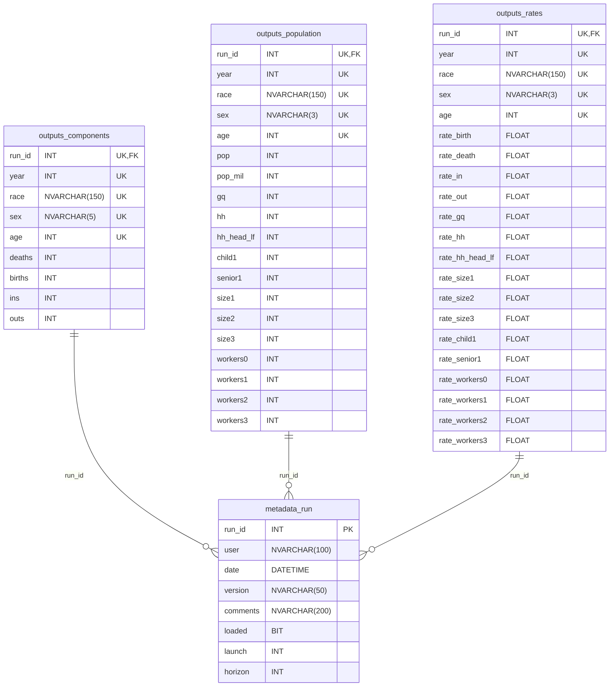

# Cohort Component Model

The Cohort Component Model (CCM) is a demographic modeling system used to project the population and households of the region. The Cohort Component Method is used to developed SANDAG's Regional Forecast using assumptions regarding fertility, mortality, migration and headship rates that align with the future economy of the San Diego Metropolitan Area. [For documentation see the project Wikipedia](https://github.com/SANDAG/Cohort-Component-Model/wiki).

## Setup
Clone the repository and ensure an installation of [Miniconda/Anaconda](https://docs.conda.io/projects/miniconda/en/latest/) exists. Use the **environment.yml** file in the root directory of the project to [create the Python virtual environment](https://docs.conda.io/projects/conda/en/4.6.1/user-guide/tasks/manage-environments.html#creating-an-environment-from-an-environment-yml-file) needed to run the project.

Set the configuration file **config.JSON** parameters specific to the model run of interest and run the **main.py** entry point file located in the project root directory.

## Configuration File Settings
*Note that the configuration file contains datasets stored on a SQL server instance accessed at runtime through queries. It is possible to provide query results as local datasets and migrate the SQL datasets to the **csv** section of the configuration file to remove the dependency on the SQL instance.*
```yaml
version: "v0.0.1"
comments: "No Comments" # Add comments pertaining to the run
configurations:  # other configuration files
  rates_map: "rates_map.yml"  # local birth/death rate files mapping
  controls: "sandag_estimates.yml"  # SANDAG Estimates Control totals
csv:  # locally stored datasets (manually entered)
  dmdc_location_report: "data/DMDC Website Location Report.csv"  # Department of Defense DMDC Report data
  sdmac_report: "data/SDMAC Report.csv"  # Military SDMAC Report data
  ss_life_table: "data/Social Security Actuarial Life Table.csv"  # Social Security Life Table data
interval:  # forecast interval (base is assumed from launch)
  launch: 2020  # last year before forecast starts
  horizon: 2050  # forecast end year
output:  # output files
  overwrite: true  # boolean true/false switch to overwrite output files
  files:  # path and names of output files to write
    components: "output/components.csv"
    population: "output/population.csv"
    rates: "output/rates.csv"
sql:  # SQL server options
  queries:  # SQL queries to be used as datasets
    census_p5: "sql/census_p5.sql"  # 2020 Census P5 table
    dof_estimates: "sql/dof_estimates.sql"  # California Department of Finance Estimates
    dof_projections: "sql/dof_projections.sql"  # California Department of Finance Projections
    pums_ca_mil: "sql/pums_ca_mil.sql"  # State of California total military population
    pums_migrants: "sql/pums_migrants.sql"  # San Diego County in/out migration
    pums_persons: "sql/pums_persons.sql"  # San Diego county population
  load_to_database: False # Set as True if output has to be loaded to database
```

### Configuration of Private Data in secrets.yml
In order to avoid exposing certain data to the public this repository uses a secrets file to store sensitive configurations in addition to a standard configuration file. This file is stored in the root directory of the repository as `secrets.yml` and is included in the `.gitignore` intentionally to avoid it ever being committed to the repository.

The `secrets.yml` should mirror the following structure where the <SqlInstanceName> is a production SQL instance containing all necessary objects required by queries contained in the `sql` folder and there is a database <SqlDatabaseName> in the production instance where the user has permission to create temporary tables and contains the SQL objects built by `sql/db_build` necessary to load output into the SQL database.

```yaml
sql:
  server: "<SqlInstanceName>"
  database: "<SqlDatabaseName>"
```
### Production Database Schema


### Streamlit Report App
This repository contains a Streamlit app that generates reports for outputs stored locally in the `output` folder or from the production SQL database specified in `secrets.yml`. You can use it to visualize the results of the run interactively using Streamlit's easy-to-use interface. The documentation can be found here https://docs.streamlit.io/.

#### Prerequisites
Before generating the report, ensure that you have the following:
- Are running in a Python virtual environment with all required dependencies listed in the `environment.yml`.

#### Generate validation reports
Run the Streamlit app in the base project directory with the following command.
```yaml
streamlit run report/CCM_Validation_Report.py