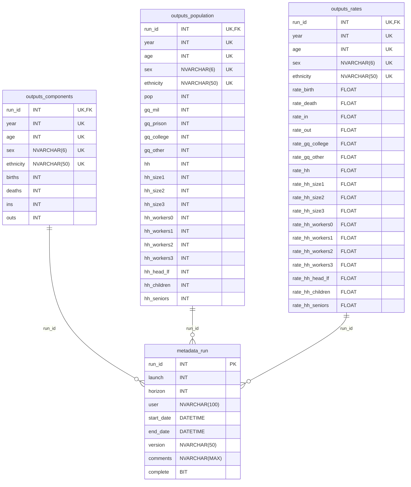

# Cohort Component Model

The Cohort Component Model (CCM) is a demographic modeling system used to project the population and households of the region. The Cohort Component Method is used to developed SANDAG's Regional Forecast using assumptions regarding fertility, mortality, migration and headship rates that align with the future economy of the San Diego Metropolitan Area. [For documentation see the project Wikipedia](https://github.com/SANDAG/Cohort-Component-Model/wiki).

# Setup
Clone the repository and ensure an installation of [uv](https://docs.astral.sh/uv/getting-started/installation/) exists. Create a local virtual environment by running `uv venv` then `uv sync` in the command line. Ensure that a `secrets.yml` file exists in the project root directory (see "Configuration of Private Data in secrets.yml" below for details).

Set the configuration file **config.yml** parameters specific to the model run of interest and run the **main.py** entry point file located in the project root directory.

## Configuration File Settings
*Note that the configuration file contains datasets stored on a SQL server instance accessed at runtime through queries. It is possible to provide query results as local datasets and migrate the SQL datasets to the **csv** section of the configuration file to remove the dependency on the SQL instance.*
```yaml
version: "0.0.0-dev"
comments: "No Comments" # Add comments pertaining to the run
configurations:
  estimates_run_id: 237  # the SANDAG Estimates Program production run to use for the launch year population
csv:
  fertility_rates: null # optional csv with columns: (year, age, sex, race, rate_birth)
  migration_controls: null  # optional csv with columns: (year,ins,outs)
  mortality_rates: null # optional csv with columns: (year, age, sex, race, rate_death)
interval:  # forecast interval
  launch: 2020  # last year before forecast starts
  horizon: 2050  # forecast end year
sql:  # SQL server options
  load_to_database: False # Set as True if output has to be loaded to database
```

### Fertility Rates File Format
If fertility rates are provided, the CSV should include one row per year, age, sex, and race/ethnicity grouping with no null values in any of the columns. Each year should include female sex (`Female`) only, each of the seven race/ethnicity categories (`Hispanic`; `Non-Hispanic, American Indian or Alaska Native`; `Non-Hispanic, Asian`; `Non-Hispanic, Black`; `Non-Hispanic, Hawaiian or Pacific Islander`; `Non-Hispanic, Two or More Races`; `Non-Hispanic, White`), and 30 single year of age values (`15-44`) to create 210 rows per year:

```csv
year,age,sex,ethnicity,rate_birth
2023,15,Female,"Non-Hispanic, American Indian or Alaska Native",0.01431606
...
2024,30,Female,"Hispanic",0.09667108
...
2025,44,Female,"Non-Hispanic, White",0.01539245
```

### Migration Controls File Format
If migration controls are provided, the CSV should include one row per year post launch year with ins/outs totals >= 0:

```csv
year,ins,outs
2023,52000,47000
2024,54000,50000
2025,53250,49100
```

### Mortality Rates File Format
If mortality rates are provided, the CSV should include one row per year, age, sex, and race/ethnicity grouping with no null values in any of the columns. Each year should include both sexes (`Male` and `Female`), each of the seven race/ethnicity categories (`Hispanic`; `Non-Hispanic, American Indian or Alaska Native`; `Non-Hispanic, Asian`; `Non-Hispanic, Black`; `Non-Hispanic, Hawaiian or Pacific Islander`; `Non-Hispanic, Two or More Races`; `Non-Hispanic, White`), and all 100 ages (0-99) to create 1400 rows per year:

```csv
year,age,sex,ethnicity,rate_death
2023,0.0,Female,"Non-Hispanic, American Indian or Alaska Native",0.0013964641191015427
...
2024,45.0,Male,"Hispanic",0.0022017810643757416
...
2025,99.0,Male,"Non-Hispanic, White",0.16650980
```

### Configuration of Private Data in secrets.yml
In order to avoid exposing certain data to the public this repository uses a secrets file to store sensitive configurations in addition to a standard configuration file. This file is stored in the root directory of the repository as `secrets.yml` and is included in the `.gitignore` intentionally to avoid it ever being committed to the repository.

The `secrets.yml` should mirror the following structure. 

Under the `sql: ccm` section, the `<SqlInstanceName>` and `<SqlDatabaseName>` identify the production SQL instance/server and production Cohort Component Model database where the user has permission to create temporary tables and contains the SQL objects built by `sql/db_build` necessary to load output into the SQL database.

Under the `sql: estimates` section, the `<SqlInstanceName>` and `<SqlDatabaseName>` identify the production SQL instance/server and production [SANDAG Estimate's Program](https://github.com/SANDAG/Estimates-Program) database.

```yaml
sql:
  ccm:
    server: "<SqlInstanceName>"
    database: "<SqlDatabaseName>"
  estimates:
    server: "<SqlInstanceName>"
    database: "<SqlDatabaseName>"
```

# Production Database Schema
For more details regarding individual tables and fields see the [Model Outputs](https://github.com/SANDAG/Cohort-Component-Model/wiki/Model-Outputs) section of the Wiki.

```mermaid
erDiagram
direction TB

    metadata_run {
        run_id INT PK
        launch INT
        horizon INT
        user NVARCHAR(100)
        start_date DATETIME
        end_date DATETIME
        version NVARCHAR(50)
        comments NVARCHAR(MAX)
        complete BIT
    }

    outputs_components {
        run_id INT UK, FK
        year INT UK
        age INT UK
        sex NVARCHAR(6) UK
        ethnicity NVARCHAR(50) UK
        births INT
        deaths INT
        ins INT
        outs INT
    }

    outputs_population {
        run_id INT UK, FK
        year INT UK
        age INT UK
        sex NVARCHAR(6) UK
        ethnicity NVARCHAR(50) UK
        pop INT
        gq_mil INT
        gq_prison INT
        gq_college INT
        gq_other INT
        hh INT
        hh_size1 INT
        hh_size2 INT
        hh_size3 INT
        hh_workers0 INT
        hh_workers1 INT
        hh_workers2 INT
        hh_workers3 INT
        hh_head_lf INT
        hh_children INT
        hh_seniors INT
    }
    
    outputs_rates {
        run_id INT UK, FK
        year INT UK
        age INT UK
        sex NVARCHAR(6) UK
        ethnicity NVARCHAR(50) UK
        rate_birth FLOAT
        rate_death FLOAT
        rate_in FLOAT
        rate_out FLOAT
        rate_gq_college FLOAT
        rate_gq_other FLOAT
        rate_hh FLOAT
        rate_hh_size1 FLOAT
        rate_hh_size2 FLOAT
        rate_hh_size3 FLOAT
        rate_hh_workers0 FLOAT
        rate_hh_workers1 FLOAT
        rate_hh_workers2 FLOAT
        rate_hh_workers3 FLOAT
        rate_hh_head_lf FLOAT
        rate_hh_children FLOAT
        rate_hh_seniors FLOAT
    }

    outputs_components ||--o{ metadata_run : "run_id"
    outputs_population ||--o{ metadata_run : "run_id"
    outputs_rates ||--o{ metadata_run : "run_id"
```

# Streamlit Report App
This repository contains a Streamlit app that generates reports for outputs stored locally in the `output` folder or from the production SQL database specified in `secrets.yml`. You can use it to visualize the results of the run interactively using Streamlit's easy-to-use interface. The documentation can be found here https://docs.streamlit.io/. Run the Streamlit app in the base project directory with the following command.

```cmd
streamlit run report/CCM_Validation_Report.py
```

# Versioning and Releases
This repository follows a non-standard release schedule. Rather than doing a new release after changes, bug fixes, or new features, a release is generally made when there is new output data ready to be shared with members outside the Estimates & Forecasts team or if data is planned to be used for any official purposes.

## Release Format
Releases follow a standard format which can be seen on any release on the [Releases page](https://github.com/SANDAG/Cohort-Component-Model/releases). Each release is associated with a newly created Git tag for the released version in the format `X.X.X` (also see [Semantic Versioning](https://semver.org/)). The release title matches the tagged version in this format: `Cohort Component Model X.X.X`. Release notes begin with metadata describing the purpose of the release and the production database `[run_id]`(s) for external consumption associated with that release. An optional `Major Update(s)` section follows, summarizing the automatically generated release notes listed below it. The automatically generated release notes are created by clicking the "Generate release notes" button

## How to Release
Once a production run is ready for external consumption, the following manual steps are performed. Note, these changes can be made directly to the `main` branch:

1. Set the `config.yml` default version to the new release version `X.X.X`
2. Add the new release version `X.X.X` to the allowed versions defined in `_validate_config()` in the file `python/parsers.py`
3. Update the default configuration example in `README.md` to show `X.X.X`
4. A tag and release is made following the release format described above.
5. Any associated `[run_id]`(s) in the production database identified in the release notes have the `[version]` field in the `[metadata].[run]` table manually updated to reflect the release version `X.X.X`.
6. Repeat steps 1-3 but with version `X.X.X-dev`